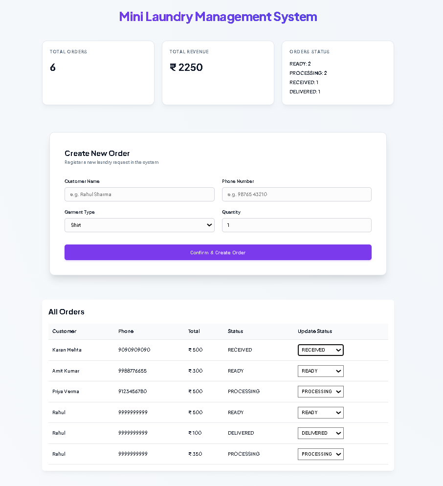
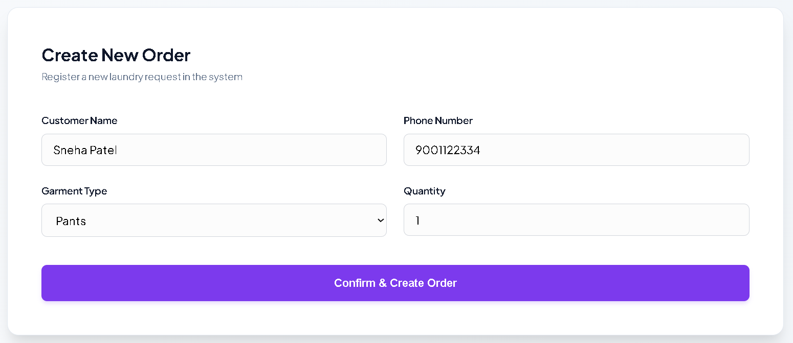
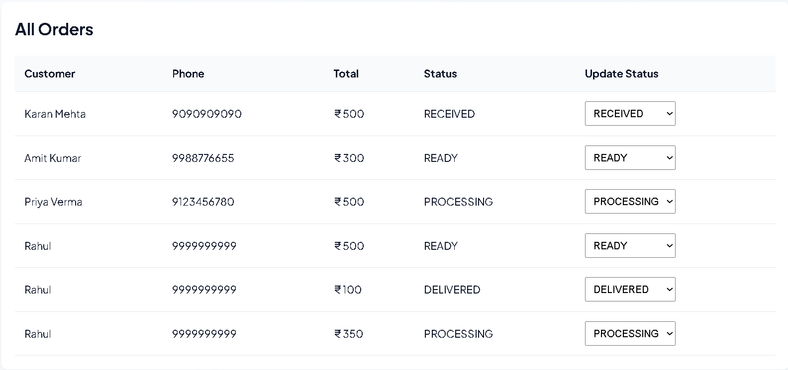
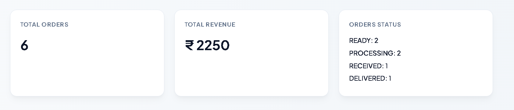

````md
# Mini Laundry Order Management System

A full-stack laundry order management system built as part of the Quick Dry Cleaning Software Development Engineering Internship assignment.

This application helps a dry cleaning store manage:
- Laundry orders
- Billing
- Order tracking
- Status updates
- Dashboard analytics

---

# Live Demo

## Frontend

https://mini-laundry-order-management-syste-seven.vercel.app

---

## Backend API

https://laundry-management-backend.onrender.com

---

# Features

## Backend Features
- Create laundry orders
- Automatic bill calculation
- Unique Order ID generation
- Order status management
- Dashboard analytics
- MongoDB database integration
- REST APIs

---

## Frontend Features
- Modern responsive dashboard UI
- Create order form
- Orders management table
- Status update dropdown
- Real-time dashboard updates
- Revenue analytics cards

---

# Tech Stack

## Frontend
- React
- Vite
- Axios
- CSS

## Backend
- Node.js
- Express.js
- MongoDB
- Mongoose

---

# Project Structure

```bash
mini-laundry-order-management-system/
│
├── backend/
├── frontend/
├── screenshots/
│   ├── dashboard.png
│   ├── create-order.png
│   ├── orders-table.png
│   └── status-update.png
│
├── Laundry-Management-System-API.postman_collection.json
└── README.md
````

---

# Setup Instructions

## 1. Clone Repository

```bash
git clone https://github.com/JayantBansal900/mini-laundry-order-management-system.git
```

---

## 2. Backend Setup

```bash
cd backend
npm install
```

Create `.env` file:

```env
PORT=5000
MONGO_URI=your_mongodb_connection_string
```

Run backend server:

```bash
npm run dev
```

Backend runs on:

```bash
http://localhost:5000
```

---

## 3. Frontend Setup

```bash
cd frontend
npm install
npm run dev
```

Frontend runs on:

```bash
http://localhost:5173
```

---

# API Endpoints

## Create Order

```http
POST /api/orders
```

---

## Get All Orders

```http
GET /api/orders
```

---

## Filter Orders

```http
GET /api/orders?status=PROCESSING
```

```http
GET /api/orders?customerName=rahul
```

---

## Update Order Status

```http
PUT /api/orders/:id/status
```

---

## Dashboard Analytics

```http
GET /api/orders/dashboard
```

---

# Screenshots

## Dashboard



---

## Create Order



---

## Orders Table



---

## Status Update



---

# AI Usage Report

AI tools were heavily used during the development of this project to accelerate implementation and improve productivity.

## Tools Used

* ChatGPT
* GitHub Copilot
* Gemini

---

## How AI Helped

AI tools assisted with:

* Backend API scaffolding
* MongoDB integration guidance
* React component generation
* UI styling improvements
* Debugging support
* API testing workflows
* README documentation

---

## Sample Prompts Used

* "Create Express.js API for laundry order management"
* "Generate MongoDB schema for laundry orders"
* "Build React dashboard UI"
* "Implement order status update API"
* "Improve SaaS dashboard CSS styling"

---

## Improvements Made Beyond AI Suggestions

Some AI-generated solutions required manual debugging and optimization:

* MongoDB Atlas TLS connection fixes
* Express route ordering fixes
* Responsive UI adjustments
* Typography balancing
* Frontend-backend synchronization fixes
* Vite compatibility troubleshooting

---

# Challenges Faced

* MongoDB Atlas SSL/TLS connection issues
* Managing real-time frontend refresh after updates
* Responsive dashboard layout optimization
* Status validation implementation

---

# Tradeoffs

To keep the project lightweight and focused within the assignment timeline:

* Authentication was not implemented
* Multi-garment dynamic forms were simplified
* Payment gateway integration was skipped
* Advanced admin role management was not added

---

# Future Improvements

* Authentication & Authorization
* Multi-item garment forms
* Search by garment type
* Payment integration
* Deployment improvements
* Advanced analytics dashboard
* Export invoices as PDF

---

# Postman Collection

Included in the project root:

```bash
Laundry-Management-System-API.postman_collection.json
```

---

# Author

## Jayant Bansal

GitHub:
https://github.com/JayantBansal900

```
```
